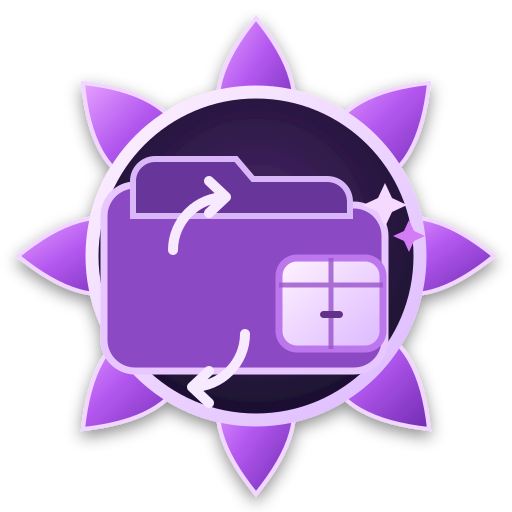

<p align="center">
 <strong>Assemblia — Garry's Mod Collection Optimizer</strong><br/>
 A desktop utility for merging, cleaning, benchmarking, and splitting addon collections into deployment-ready content packs.<br/>
 Built for server owners and content maintainers working with large workshop exports and addon libraries.
</p>

<p align="center">
 
</p>

<p align="center">
 <a href="./license">
  
 </a>
 
 
 <a href="https://github.com/bleonheart/Assemblia/stargazers">
  
 </a>
</p>

---

## Overview

Assemblia turns large Garry's Mod addon directories into cleaner, easier-to-deploy content packs.

The application provides a PySide6 desktop interface for selecting source and destination directories, consolidating addon files, removing unnecessary model formats, separating Lua content, benchmarking workloads, and splitting the resulting collection into size-limited packs.

## Quick Start

Clone the repository:

```bash
git clone https://github.com/bleonheart/Assemblia.git
cd Assemblia
```

Install PySide6:

```bash
python -m pip install PySide6
```

Launch with the provided Windows launcher:

```bat
run.bat
```

Or run the application directly:

```bash
python collectionoptimizer.py
```

## Features

### Merge Addons

Merge top-level addon directories into a shared destination tree.

The merge workflow can:

- Move files into a consolidated content directory
- Detect duplicate destination paths
- Remove duplicate source files
- Track processed addons and moved files
- Track duplicate space savings
- Remove unsupported Source model sidecar formats
- Remove empty directories after processing

### Split Content

Split merged content into sequential packs under:

```text
Destination/Addons/
```

Pack boundaries use the configured maximum pack size.

The default is:

```text
3.90 GB
```

### Lua Separation

Lua files can optionally be separated from the main content tree.

When enabled, they are written under:

```text
Destination/Lua/<AddonName>/
```

Trailing numeric addon suffixes such as `_1` or `_27` are normalized when building Lua output directories.

### Garry's Mod Cleanup

Assemblia removes Source model formats that are generally unnecessary for Garry's Mod deployment:

- `.dx80.vtx`
- `.xbox.vtx`
- `.sw.vtx`
- `.360.vtx`

It also removes empty directories left behind during merge and cleanup operations.

### Benchmarking

Benchmark tools let you inspect the collection before changing files.

Available workload information includes:

- Addon count
- File count
- Total content size
- Destination size
- Estimated pack count
- Merge and split workload information

### Persistent Settings

Settings are stored in `settings.json`.

Persisted values include:

- Source directory
- Destination directory
- Maximum pack size

The application restores these values between launches.

## Data Safety

> **Use a backup, disposable export, or version-controlled source directory.**

The merge operation is intentionally destructive to the source tree.

During processing:

- Files are moved out of source addon directories
- Duplicate source files may be deleted
- Processed addon directories are removed
- Optional cleanup removes unnecessary model files

The split workflow copies merged data into numbered packs. If deletion of original merged files is enabled, those originals are removed after splitting.

Use benchmark functionality before destructive operations when you want to inspect the workload first.

## Typical Workflow

1. Export or download addons into a source directory
2. Select the source in Assemblia
3. Choose a clean destination
4. Configure the maximum pack size
5. Decide whether Lua should be separated
6. Run a benchmark
7. Run **Merge**, **Split**, or **Merge + Split**
8. Review the operation summary and logs
9. Use the generated packs for deployment or upload

## Repository Structure

```text
Assemblia/
├── collectionoptimizer.py
├── run.bat
├── settings.json
├── README.md
└── license
```

## Requirements

- Python 3.10 or newer
- PySide6
- Windows for the provided batch launcher and default path conventions

Install the UI dependency with:

```bash
python -m pip install PySide6
```

## Contributing

Contributions to performance, cleanup logic, UI behavior, reporting, and deployment workflows are welcome.

1. Fork the repository
2. Create a feature branch
3. Make and test your changes
4. Open a pull request with a clear explanation of the workflow being improved

## License

Current versions of Assemblia are licensed under the PolyForm Noncommercial License 1.0.0. Commercial use is not licensed under these terms.

Earlier versions released under the MIT License remain available under the MIT terms that applied to those versions. Third-party material, if any, remains subject to its own license.

See [license](./license) for details.

---

<p align="center">
 <strong>Turn large addon collections into cleaner deployment packs.</strong>
</p>